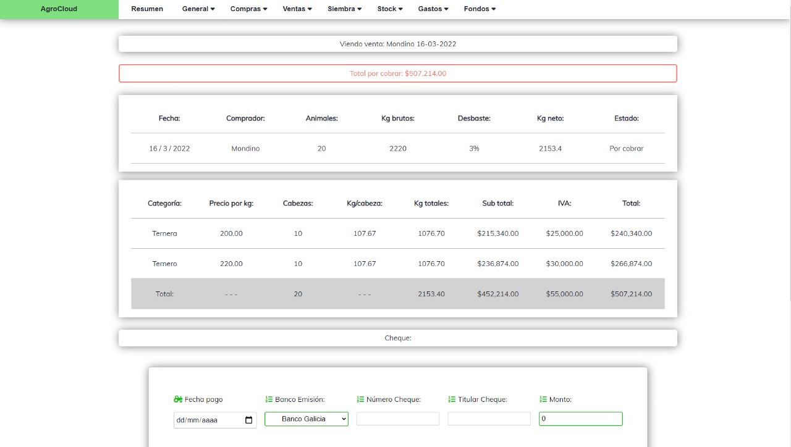

# Cloud-Agro
## What does this WebApp do?
### AgroCloud is an accounting and stock-managing web app created for industrial agriculture. It includes a wide variety of features that make it possible for an agriculture business to keep track of yearly farming campaigns. 

## This project Includes:

## Create views:
### Create views include forms, formsets, and other functionalities. Once you create an object, you are redirected to the objects detail. In this case, this user just sold 20 cows.

## Detail views:
### Detail views give you information about the given object, some detail views include the option to add payments to the purchase/expense/sale, etc.

