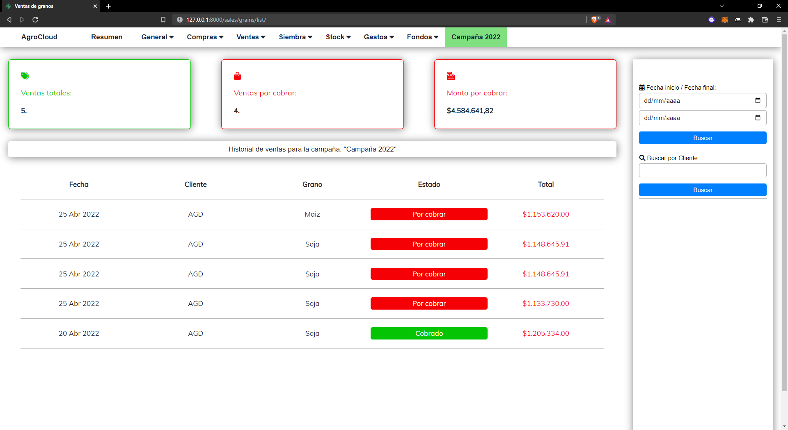

# Cloud-Agro
## What does this WebApp do?
AgroCloud is an accounting and stock-managing web app created for industrial agriculture. It includes a wide variety of features that make it possible for an agriculture business to keep track of yearly farming campaigns. 

## Who is this webapp for?
This software was initially created for a client of mine, but given the growing demand in my area for these kind of products, I decided to make the app as generic as possible so that it can be re-selled. This would be a great fit for any family-driven or small agriculture company that is needing to keep track of it's bussinesse´s accounting and/or yields.

## Sections:
* **General:** Allows you to create named farms that then can be linked to purchases/sales, etc. As well as letting you create a farming campaign. 
*  In this section you can also access the farm´s allotments, in the allotments tab you register your sowing product´s usage.
*  **Compras:** Allows you to create animal and sowing purchases, from here you can also access their list views. 
*  **Ventas:** Allows you to create animal and sowing sales, from here you can also access their detail views. 
*  **Siembra:** Allows you to see the average price of every sowing product you bought (Fertilizers, seeds, etc.).
*  **Stock:** Allows you to see the stock situation for sowing products and animals.
*  **Gastos:** Allows you to add expenses to your farm, as well as a summary of expenses divided by categories. 
*  **Fondos:** Calculates your bank and cash funds by using all your purchases, sales and expenses. It also has a cheques tab that tells how much time is left for paying/retrieving a check. 

(All these navbar sections have dropdowns that redirect you to the app´s views)
## 

## This project Includes:

## Dashboard view:
Here the user can see their funds, cereals' stock, animals' stock, and fertilizers, seeds and other products' stock.

## Create views:
Create views include forms, formsets, and other functionalities. Once you create an object, you are redirected to the objects detail. In this case, this user just sold 20 cows.

## Detail views:
Detail views give you information about the given object, some detail views include the option to add payments to the purchase/expense/sale, etc. You can also edit or delete the showcased object.

## List views:
List views include all objects of a give type, you can also easily see unpayed purchases/sales/expenses, etc., as well as querying the objects by a date range or by the name of the costumer or provider. If you click a listed object you can access the object's detail view.

## Payments:
Certain objects allow you to register payments in their detail views, payments in cash or bank transfer and cheques are all coded using generic foreign-keys so that the models can be related to multiple other models on demand. Once the payment is registered, it discounts the amount to pay or to receive. In this case the user registers a cheque payment for his cow purchase.

